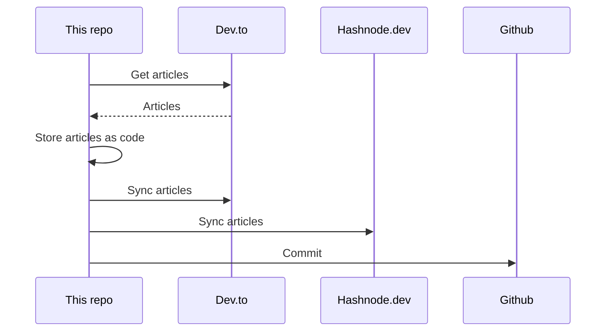

## About
This is the "single source of truth" that stores all my articles.

It utilizes [huantt/article-as-code](https://github.com/huantt/article-as-code) to collect, store, and sync all my articles to various platforms, including [dev.to](https://dev.to) and [hashnode.dev](https://hashnode.dev).

## GitHub Action
I have created a GitHub action in the `.github/workflows` directory that runs every 6 hours or whenever you commit to the `main` branch.

## My Recent Articles

<table>
        <tr>
            <td width="300px">
                <a href="https://dev.to/devcloudninjas/end-to-end-cicd-pipeline-using-github-actions-for-android-application-36i5">
                    
                </a>
            </td>
            <td>
                <a href="https://dev.to/devcloudninjas/end-to-end-cicd-pipeline-using-github-actions-for-android-application-36i5">End to End CI/CD pipeline using GitHub Actions for Android...</a>
                <div>In this article, you will get a brief idea about how to create an End to End CI/CD Pipeline using...</div>
                <div><i>13/12/2024</i></div>
            </td>
        </tr>
        <tr>
            <td width="300px">
                <a href="https://dev.to/devcloudninjas/devops-from-0-to-hero-for-freshers-3mj4">
                    
                </a>
            </td>
            <td>
                <a href="https://dev.to/devcloudninjas/devops-from-0-to-hero-for-freshers-3mj4">DevOps from 0 to Hero - for Freshers</a>
                <div>Introduction   DevOps is a transformative culture and set of practices that bring together...</div>
                <div><i>20/10/2024</i></div>
            </td>
        </tr>
        <tr>
            <td width="300px">
                <a href="https://dev.to/softwaresennin/deploying-django-application-on-aws-with-terraform-1j7e">
                    
                </a>
            </td>
            <td>
                <a href="https://dev.to/softwaresennin/deploying-django-application-on-aws-with-terraform-1j7e">Deploying Django Application on AWS with Terraform - Part 1</a>
                <div>Hi everyone, I am back with another project. This time we will be working on a CICD pipeline,...</div>
                <div><i>01/04/2024</i></div>
            </td>
        </tr>
        <tr>
            <td width="300px">
                <a href="https://dev.to/softwaresennin/thank-you-so-much-everyone-p7j">
                    
                </a>
            </td>
            <td>
                <a href="https://dev.to/softwaresennin/thank-you-so-much-everyone-p7j">Thank you so much everyone!</a>
                <div>Hi fam, I&#39;m so excited to announce that I&#39;ve reached 30,000 views and 6K&#43; followers! This is such a...</div>
                <div><i>21/10/2023</i></div>
            </td>
        </tr>
        <tr>
            <td width="300px">
                <a href="https://dev.to/aws-builders/how-netflix-uses-the-cloud-aws-191c">
                    
                </a>
            </td>
            <td>
                <a href="https://dev.to/aws-builders/how-netflix-uses-the-cloud-aws-191c">How Netflix Uses the Cloud - AWS</a>
                <div>How they Use AWS Services   Binge-watching 🍿has become more and more of a phenomena. Netflix...</div>
                <div><i>27/08/2023</i></div>
            </td>
        </tr>
</table>

<div align="right">

*Updated at: 2025-04-23T12:55:25Z - by **[huantt/article-listing](https://github.com/huantt/article-listing)***

</div>


## Run Locally
The `docker-compose.yml` file helps us run the flow locally.

To run this Docker Compose, create a `.secret.txt` file and fill in the following variables:
- `DEVTO_TOKEN`: Your Dev.to authentication token.
- `DEVTO_USERNAME`: Your Dev.to username.
- `HASHNODE_TOKEN`: Your Hashnode authentication token.
- `HASHNODE_USERNAME`: Your Hashnode username.

Run the following command:
```shell
docker-compose up
```

## Sequence Diagram
