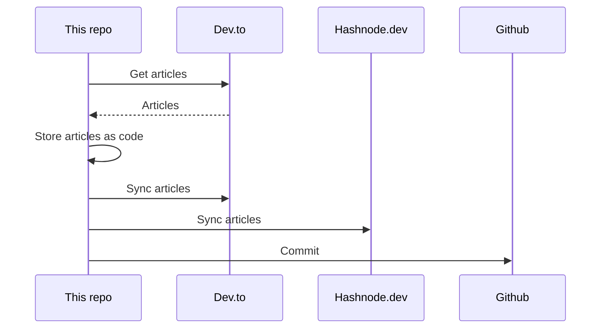

## About
This is the "single source of truth" that stores all my articles.

It utilizes [huantt/article-as-code](https://github.com/huantt/article-as-code) to collect, store, and sync all my articles to various platforms, including [dev.to](https://dev.to) and [hashnode.dev](https://hashnode.dev).

## GitHub Action
I have created a GitHub action in the `.github/workflows` directory that runs every 6 hours or whenever you commit to the `main` branch.

## My Recent Articles

<table>
        <tr>
            <td width="300px">
                <a href="https://dev.to/softwaresennin/thank-you-so-much-everyone-p7j">
                    
                </a>
            </td>
            <td>
                <a href="https://dev.to/softwaresennin/thank-you-so-much-everyone-p7j">Thank you so much everyone!</a>
                <div>Hi fam, I&#39;m so excited to announce that I&#39;ve reached 30,000 views and 6K&#43; followers! This is such a...</div>
                <div><i>21/10/2023</i></div>
            </td>
        </tr>
        <tr>
            <td width="300px">
                <a href="https://dev.to/aws-builders/how-netflix-uses-the-cloud-aws-191c">
                    
                </a>
            </td>
            <td>
                <a href="https://dev.to/aws-builders/how-netflix-uses-the-cloud-aws-191c">How Netflix Uses the Cloud - AWS</a>
                <div>How they Use AWS Services   Binge-watching 🍿has become more and more of a phenomena. Netflix...</div>
                <div><i>27/08/2023</i></div>
            </td>
        </tr>
        <tr>
            <td width="300px">
                <a href="https://dev.to/aws-builders/every-project-deserves-its-cicd-pipeline-no-matter-how-small-19j9">
                    
                </a>
            </td>
            <td>
                <a href="https://dev.to/aws-builders/every-project-deserves-its-cicd-pipeline-no-matter-how-small-19j9">Every Project Deserves its CI/CD pipeline, no matter how small</a>
                <div>TL;DR   In today&#39;s tech industry, setting up a CI/CD pipeline is quite easy. Creating a...</div>
                <div><i>28/08/2023</i></div>
            </td>
        </tr>
        <tr>
            <td width="300px">
                <a href="https://dev.to/softwaresennin/create-your-first-web-app-using-chatgpt-2174">
                    
                </a>
            </td>
            <td>
                <a href="https://dev.to/softwaresennin/create-your-first-web-app-using-chatgpt-2174">Create your first Web-app using ChatGPT</a>
                <div>Introduction   Language translation is essential in our globalized world, bridging language...</div>
                <div><i>21/08/2023</i></div>
            </td>
        </tr>
        <tr>
            <td width="300px">
                <a href="https://dev.to/aws-builders/localstack-emulate-aws-services-for-local-development-testing-eoj">
                    
                </a>
            </td>
            <td>
                <a href="https://dev.to/aws-builders/localstack-emulate-aws-services-for-local-development-testing-eoj">LocalStack: Emulate AWS Services for Local Development &amp; Testing</a>
                <div>It can be time-consuming, difficult, and even dangerous to create and test cloud-based apps in a...</div>
                <div><i>22/07/2023</i></div>
            </td>
        </tr>
</table>

<div align="right">

*Updated at: 2024-01-10T12:40:08Z - by **[huantt/article-listing](https://github.com/huantt/article-listing)***

</div>


## Run Locally
The `docker-compose.yml` file helps us run the flow locally.

To run this Docker Compose, create a `.secret.txt` file and fill in the following variables:
- `DEVTO_TOKEN`: Your Dev.to authentication token.
- `DEVTO_USERNAME`: Your Dev.to username.
- `HASHNODE_TOKEN`: Your Hashnode authentication token.
- `HASHNODE_USERNAME`: Your Hashnode username.

Run the following command:
```shell
docker-compose up
```

## Sequence Diagram
